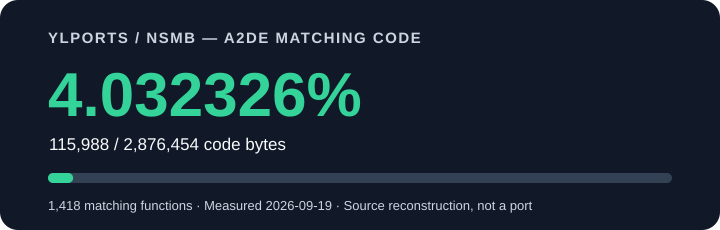

# New Super Mario Bros. — YlPorts decompilation

<!-- A2DE_PROGRESS_START -->

  

## **4.032326% matching code — this fork**

| Verified A2DE metric | Current result |
| --- | ---: |
| Matching code bytes | **115,988 / 2,876,454** |
| Matching functions | **1,418 / 15,667** |

Measured **2026-09-19**. The percentage is based on code bytes, not function count, playable levels or a PC/Android port.

**Latest pass: +195 matching functions / +24,284 code bytes.**
[Measurement details](progress/A2DE.md) · [Machine-readable totals](progress/summary.json) · [Latest batch](progress/batches/current.json)

This counter tracks **YlPorts/nsmb-**, not the separate upstream decomp.dev counter. Update it from a new local objdiff report with `python3 tools/update_progress.py --report build/report.json --date YYYY-MM-DD`; CI checks that the visible counter and stored totals agree.
<!-- A2DE_PROGRESS_END -->

> [!CAUTION]
> This project is currently in early stages and is unable to be compiled into a full rom at this time  
> If you would like to help develop this project read [contributing.md](contributing.md)

# Supported releases

| No-Intro Name                                                                                                                           | Product Code | Build Date          | Progress    |
| --------------------------------------------------------------------------------------------------------------------------------------- | ------------ | ------------------- | ----------- |
| [New Super Mario Bros. (USA, Australia)](https://datomatic.no-intro.org/index.php?page=show_record&s=28&n=0434)                         | A2DE         | 2006-03-29 09:48:19 | [**4.032326% (this fork)**](progress/A2DE.md) |
| [New Super Mario Bros. (Japan)](https://datomatic.no-intro.org/index.php?page=show_record&s=28&n=0442)                                  | A2DJ         | 2006-04-04 19:07:45 | None        |
| [New Super Mario Bros. (Japan) (Demo) (Kiosk, A85J)](https://datomatic.no-intro.org/index.php?page=show_record&s=28&n=z054)             | A85J         | 2006-04-07 11:17:21 | None        |
| [New Super Mario Bros. (USA) (Demo) (Kiosk)](https://datomatic.no-intro.org/index.php?page=show_record&s=28&n=x100)                     | A85E         | 2006-04-07 11:29:13 | None        |
| [New Super Mario Bros. (Europe) (En,Fr,De,Es,It)](https://datomatic.no-intro.org/index.php?page=show_record&s=28&n=0479)                | A2DP         | 2006-04-26 14:20:08 | None        |
| [New Super Mario Bros. (Europe) (En,Fr,De,Es,It) (Demo) (Kiosk)](https://datomatic.no-intro.org/index.php?page=show_record&s=28&n=x039) | A85P         | 2006-04-27 11:13:34 | None        |
| [2006-Nen 10-Gatsu Taikenban Soft (Japan) (Demo) (Kiosk)](https://datomatic.no-intro.org/index.php?page=show_record&s=28&n=z126)[^1]    | A85J_1[^2]   | 2006-09-01 20:30:18 | None        |
| [New Super Mario Bros. (Korea) ](https://datomatic.no-intro.org/index.php?page=show_record&s=28&n=0879)                                 | A2DK         | 2006-12-27 14:32:43 | None        |
| [New Chaoji Maliou Xiongdi (China) (iDS)](https://datomatic.no-intro.org/index.php?page=show_record&s=28&n=x142)                        | A2DC         | 2009-04-27 20:29:28 | None        |
| [New Super Mario Bros. (Japan) (Demo) (Kiosk, Y7QJ)](https://datomatic.no-intro.org/index.php?page=show_record&s=28&n=z393)             | Y7QJ[^3]     | 2009-10-23 16:23:25 | None        |

[^1]: Multi-demo cart
[^2]: This NSMB ROM has the same Product Code as the standard JP demo, so "_1" is appended here
[^3]: This build uses a 2.0 version of the mwcc compiler
<!--
This build is identical to A85P above but it also includes a autoboot flag 
| [x168 - New Super Mario Bros. (Europe) (En,Fr,De,Es,It) (Demo) (Kiosk, Y78P)](https://datomatic.no-intro.org/index.php?page=show_record&s=28&n=x168) | A85P         | None        | 2006-04-27 11:13:34 |

These Wii U Virtual console releases seem to be idential to the builds above, however they have some extra data in the range 0x1000-0x3FFF.
| [z434 - New Super Mario Bros. (Japan) (Wii U Virtual Console)](https://datomatic.no-intro.org/index.php?page=show_record&s=28&n=z434)                   | WUP-N-DADJ   | None        | 2006-04-04 19:07:45 |
| [z435 - New Super Mario Bros. (USA) (Wii U Virtual Console)](https://datomatic.no-intro.org/index.php?page=show_record&s=28&n=z435)                     | WUP-N-DADE   | None        | 2006-03-29 09:48:19 |
| [z436 - New Super Mario Bros. (Europe) (En,Fr,De,Es,It) (Wii U Virtual Console)](https://datomatic.no-intro.org/index.php?page=show_record&s=28&n=z436) | WUP-N-DADP   | None        | 2006-04-26 14:20:08 |
-->
